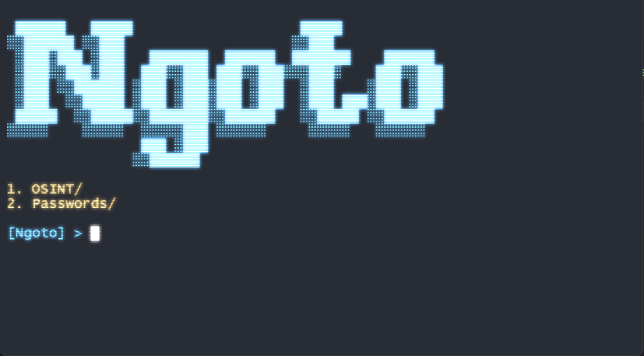

# Ngoto
[]()
[](https://codeclimate.com/github/HarryLudemann/Ngoto/maintainability)
[](https://lgtm.com/projects/g/HarryLudemann/Ngoto/context:python)

[](https://github.com/Datalux/Osintgram/releases/tag/1.3)
[](https://github.com/loseys/Oblivion/)


# Warning :warning:

<p align="center"><b>This tool is solely for educational purposes. Developer will not be responsible for any misuse of the tool</b></p>    

# Setup:
## Using as Command line tool:
#### 1. Clone Repo:
```
git clone https://github.com/HarryLudemann/Ngoto
```

#### 2. Install Required Modules:
Move into downloaded Ngoto folder then run:
```
pip install -r requirements.txt
```
or
```
pip3 install -r requirements.txt
```

#### 4. Run
Run 'python/python3 main.py' script:
```
python main.py
```
or
```
python3 main.py
```
Which will bring you to the following:



# Examples:

## Plugin:
```python
from ngoto import Plugin, interface, Table # used in this plugin

class Plugin(Plugin):
    name = 'IP'
    version = 0.1
    description = 'Get IP'
    req_modules: list = []
    req_apis: list = []
    parameters: list = []
    os: list = ['Linux', 'Windows', 'MacOS']

    # Returns dict of acquired information, given desired information
    def get_context(self, target_url):
        return {"ip": "192.181.1.1"}

    # main function to handle input, then calls and return get_context method
    def main(self, logger):
        target = interface.get_input("[URL] Target URL eg. thaturl.com: ")
        context = self.get_context(target)
        return context

    # given context of information prints information
    def print_info(self, context):
        table = Table(title="Ngoto URL Plugin")   
        self.table.add_column("Description", justify="center")
        self.table.add_column("Value", justify="center")
        table.add_row("IP", context['ip'])
        interface.output(self.table)
```
## Command:
```python
from ngoto import Command, output
class Logs(Command):

    def get_description(self):
        return "Show logs"

    def get_actions(self):
        return ["logs", "l"]

    def perform_action(self, curr_pos, options, logger):
        if len(options) == 2:
            output(logger.get_logs(options[1]))
        else:
            output(logger.get_log())
```

## Task:
```python
from ngoto.core.util.task import Task
import psutil

class PCUsage(Task):
    id = "PCUsage"
    delay = 10
    description = "Windows Notifcation of Computer Usage, Req winsdk module"
    last_output = ""
    iteration = 0
    active = True
    os: list = ['Windows']

    def __call__(self) -> bool:
        from ngoto.core.util.notify import notify
        ram_usage = psutil.virtual_memory()[2]
        cpu_usage = psutil.cpu_percent()
        self.last_output = f"RAM used: {ram_usage}\nCPU used: {cpu_usage}"
        self.iteration += 1
        if ram_usage > 80 or cpu_usage > 80:
            notify("Computer Usage", self.last_output)
        return [self.last_output, self.id]
```
